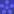

## When to use

- **Filtering:** Let users narrow lists or grids by toggling category chips.
- **Tagging:** Show applied tags/categories on cards, articles, or table rows.
- **Multi-select input:** Represent selected options in a compact, scannable row.

## Structure

- `.chip` — base pill element (use a `<button>` for interactive chips).
- `.chip__icon` — optional 16px **leading** icon slot (inline SVG, inherits `currentColor`).
- `.chip__logo` — optional 14px **trailing** brand logo slot for tag chips (`order: 1`, so markup order doesn't matter).
- `.chip-row` — flex wrapper, 8px gap, wraps. Add `data-toggle` to make all child chips toggleable via `chip.js`.
- `.chip-row--dark` — dark filter-row surface (Surface Dark fill, 24px padding, 16px radius, 10px gap).

## Variant guidance

| Variant | Typical use |
|---------|-------------|
| solid (default) | High-emphasis tag; teal-500 bg, white text |
| `--light` | Soft emphasis; teal-100 bg, teal-800 text |
| `--outline` | Unselected filter option; white bg, slate border |
| `--selected` | Active filter; teal fill + subtle teal glow |
| `--filter` | Section filter control (20px label, 22px radius) — Light style |
| `--filter --dark` | Same control on a dark section; translucent teal gradient |
| `--tag --category` | Blog category metadata (monday.com / Process automation / Integrations) |
| `--tag --product-*` | Blog product metadata; brand fill per monday product |
| `--tag --app` | App metadata with a trailing app logo |
| `--tag --tag-light` | Theme=Light for any tag chip — shared Gray 200 surface, ink text |

## Figma node map

| Figma | Node | Implementation |
|-------|------|----------------|
| Chip/Filter | `689:21718` | `.chip--filter` × `.chip--dark` × `.chip--selected` — all 8 symbols |
| Chip/Filter Row | `690:4` | `.chip-row--dark` + 4 `.chip--filter.chip--dark` |
| Chip/Blog Category | `735:4410` | `.chip--tag.chip--category` (+ `.chip--tag-light`) |
| Chip/Blog Product | `735:4385` | `.chip--tag.chip--product-{wm,dev,crm,service}` |
| Chip/App | `735:4429` | `.chip--tag.chip--app` + `assets/app-*.svg` |
| Chip/Products | `848:61721` | **Not a chip** — see `components/product-tag/` |

## Specification notes

- **Filter chip:** fixed 16/6 padding, 22px radius, 20px label in all 8 variants. Selected is solid teal-500 (teal-600 on hover) in both Light and Dark styles — the accent does not adapt to theme.
- **Dark style:** unselected background is a two-stop translucent teal gradient (23% default, 35% hover) with a white hairline at 45%/65%; the label sits at 65% white. Figma's gradient stops are `#006673 → #00B0C2`; teal-900 (`#006670`) is the nearest token and is visually identical at those alphas.
- **Tag chips:** 13px label, 4/10 padding, pill radius, 6px gap. Theme=Dark is the default (brand fill + white); Theme=Light is one shared Gray 200 surface with ink text for every category, product and app.
- **monday product fills** (`--color-monday-*`) are monday.com's own brand marks, not Carbon palette entries — they must stay exact. monday CRM's `#007682` is identical to teal-800 and reuses that token.
- Figma labels these chips in Poppins; the Carbon type ramp is Raleway-only, so all chips render in `var(--font-family)`.

## Interaction

- 200ms ease transitions on all state changes.
- Base chip hover: teal tint + 1px lift. Active: teal-700. Focus: 2px teal-500 outline.
- Filter and tag chips do **not** lift — Figma defines colour-only state changes for both.
- Tag chips are non-interactive by default (`cursor: default`); they become clickable inside a `.chip-row[data-toggle]`.
- `chip.js` toggles `.chip--selected` and syncs `aria-pressed` on click / Enter / Space for chips inside a `.chip-row[data-toggle]` (or with their own `data-toggle`).

## Do

- Use `<button>` elements for clickable chips and keep `aria-pressed` accurate.
- Use `--outline` (base) or `--filter` (Figma spec) as the unselected state in filter groups so selection is obvious.
- Use `.chip--filter.chip--dark` only on a dark surface — the translucent fill needs one to read.
- Give trailing logo images an empty `alt` — the label already names the product/app.
- Keep chip labels to 1–3 words.

## Don't

- Don't hardcode hex colors — always use `var(--color-*)` tokens.
- Don't mix a leading icon and a trailing logo on the same chip.
- Don't use `.chip--light` (teal tint) where you mean `.chip--tag-light` (neutral Gray 200 tag surface).
- Don't use chips for navigation — use text-link or buttons instead.
- Don't put the 32px logo product tag here — that's `components/product-tag/`.

## Markup reference

```html
<button class="chip">Solid</button>
<button class="chip chip--light">Light</button>
<button class="chip chip--outline">Outline</button>
<button class="chip chip--selected" aria-pressed="true">Selected</button>

<!-- Filter chip, Style=Light -->
<div class="chip-row" data-toggle>
  <button class="chip chip--filter chip--selected" aria-pressed="true">All</button>
  <button class="chip chip--filter" aria-pressed="false">monday.com</button>
</div>

<!-- Filter chip, Style=Dark, on the dark row -->
<div class="chip-row chip-row--dark" data-toggle>
  <button class="chip chip--filter chip--dark chip--selected" aria-pressed="true">All</button>
  <button class="chip chip--filter chip--dark" aria-pressed="false">Integrations</button>
</div>

<!-- Tag chips -->
<span class="chip chip--tag chip--category">Process automation</span>
<span class="chip chip--tag chip--product-wm">
  Work Management
  <span class="chip__logo"></span>
</span>
<span class="chip chip--tag chip--app">
  RingCentral
  <span class="chip__logo"></span>
</span>
<span class="chip chip--tag chip--tag-light">Integrations</span>

<script src="chip.js"></script>
```
